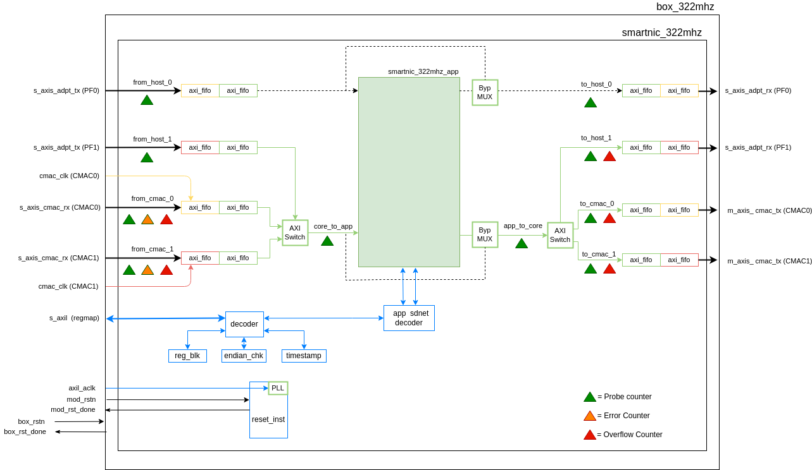

# smartnic_322mhz

Top-level module for box_322mhz of the ESnet SmartNIC platform. Includes P4 pipeline and associated logic.

## Block Diagram



## Unit Tests

This library contains unit tests implemented using the open-source SVUnit test
framework (https://github.com/tudortimi/svunit).

SVUnit is managed within the repository as a submodule and no separate installation
or setup is required.

### Vivado Simulator Support

In addition, this library contains Makefiles that support running the unit
tests using Xilinx's Vivado Simulator. Vivado is not supported natively by
SVUnit so the 'runSVUnit' script cannot be used directly. To execute the unit
tests using the Vivado simulator:

1. Configure Vivado. For example:
```
source ${XILINX_VIVADO}/settings64.sh
```

2. Execute appropriate Makefile

    Running make in one of the test directories (i.e. tests/\[testbench_name\]/) executes
    the unit tests contained within that testbench.

    ```
    make all
    ```

    Running make at the root of the library or in the tests/regression directory
    executes all of the testcases contained in all of the testbenches.

    Waves (Vivado *.wdb format)
    can be logged by passing 'waves=ON' to the make command. Example:
    ```
    make all waves=ON
    ```
